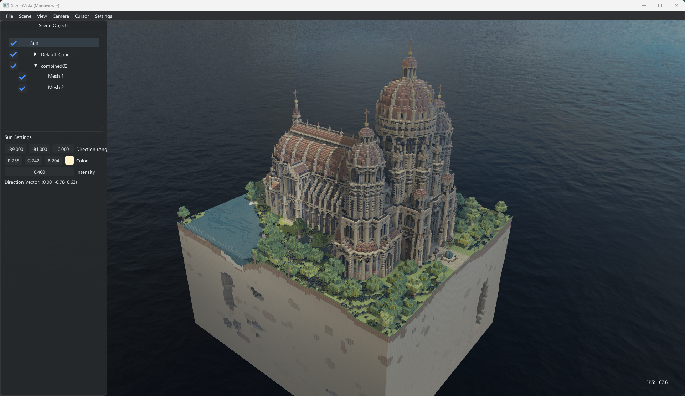
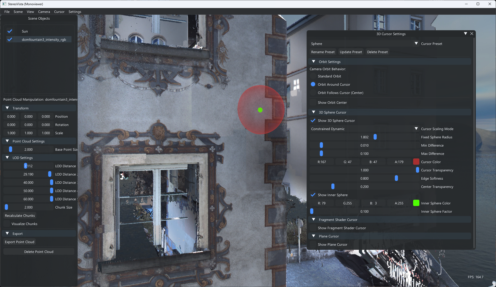
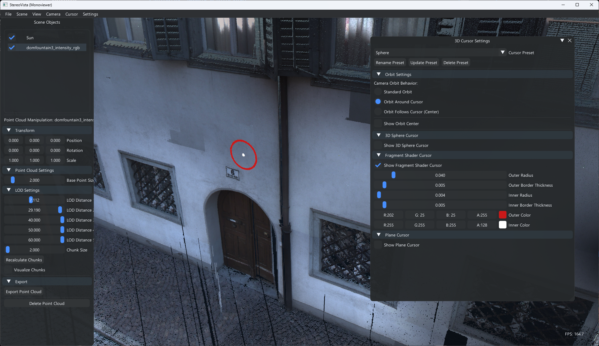
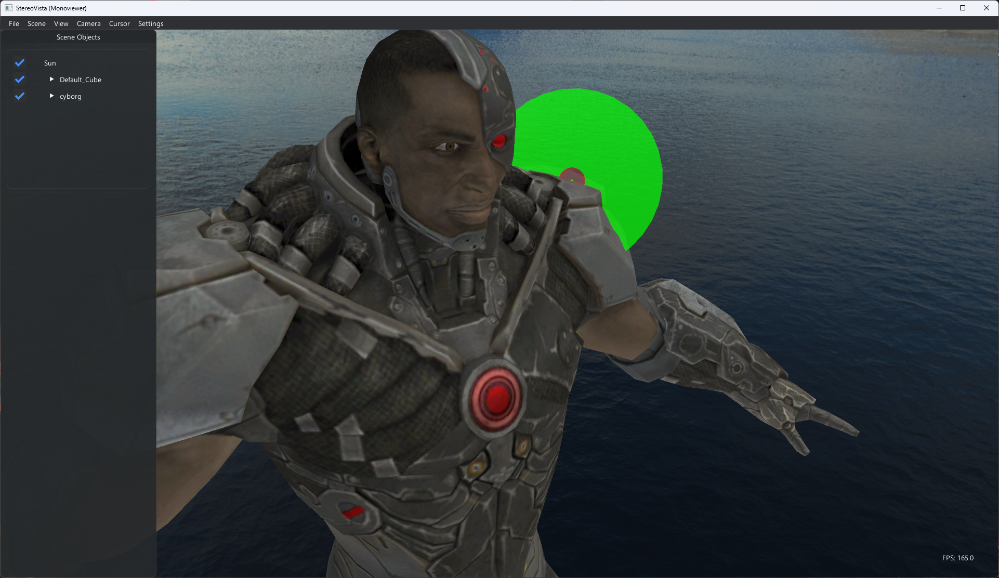
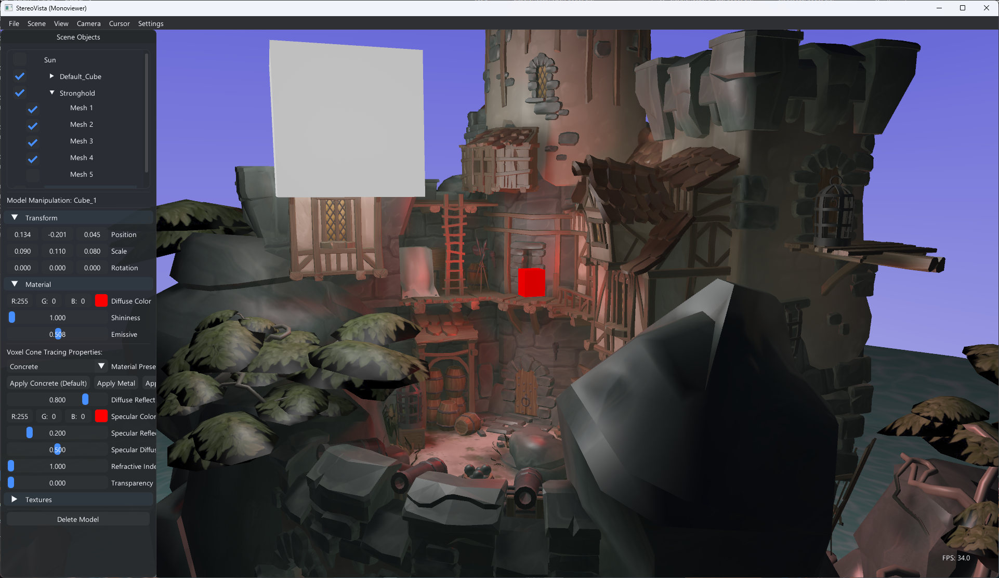
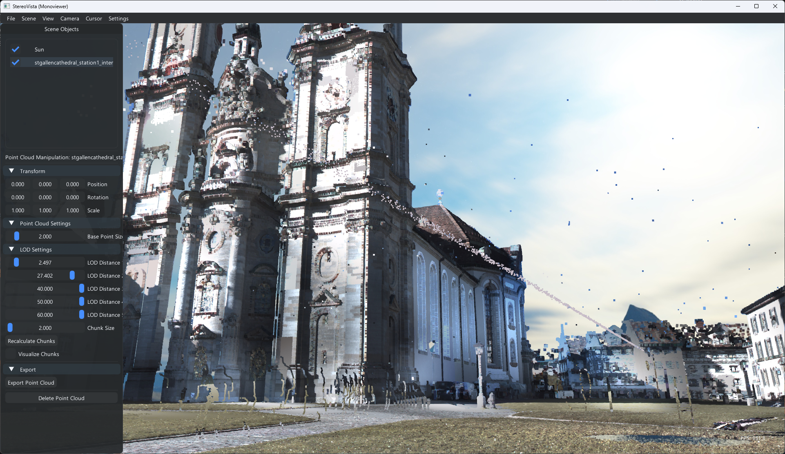
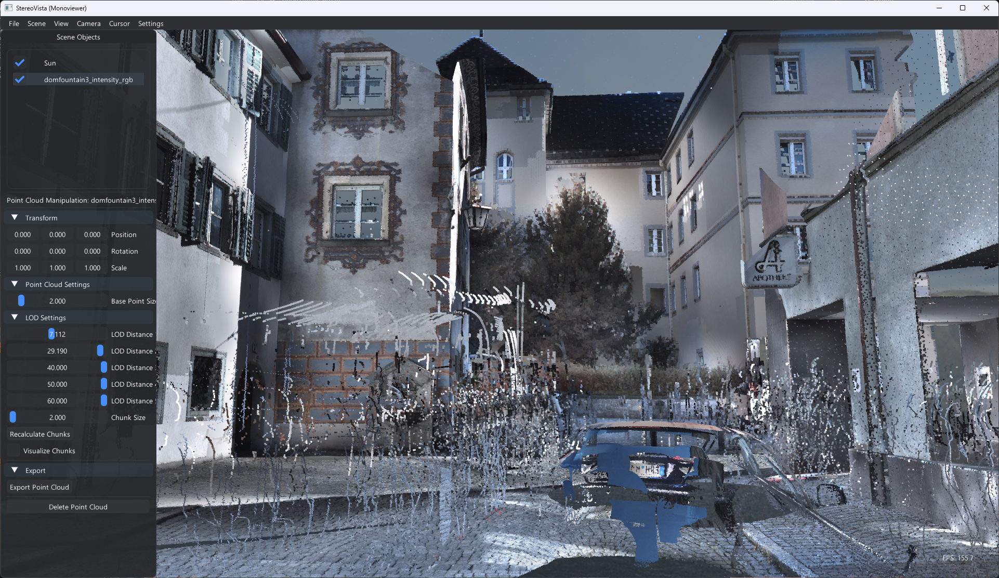
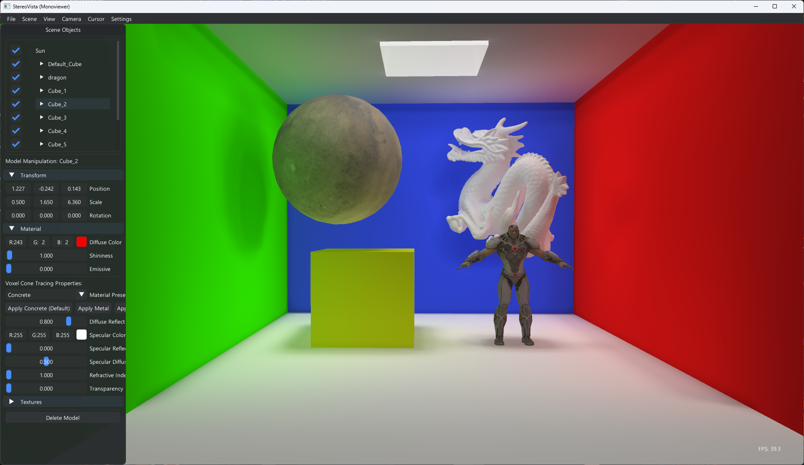
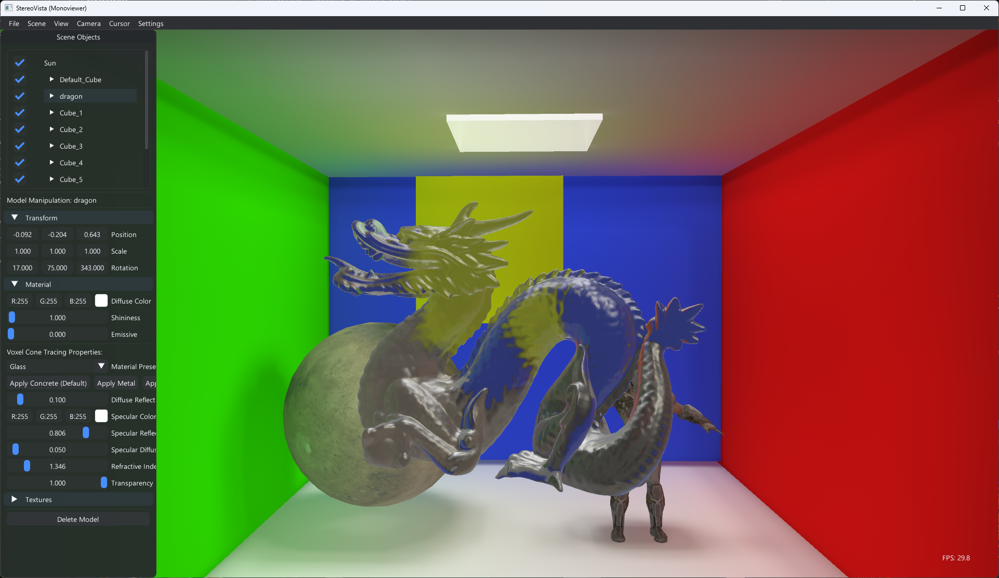

# StereoVista – Advanced Stereo 3D Viewer



StereoVista is an OpenGL 4.6 application designed for interactive visualization and manipulation of 3D models and point clouds with native stereo support and demonstartion of different stereo features and navigation methods. The application combines advanced rendering techniques with an intuitive interface and a lot of customization options.

---

## Table of Contents
1. [Key Features](#key-features)
   - [Stereo Rendering](#-native-stereo-rendering)
   - [Camera System](#-advanced-camera-system)
   - [Cursor Technology](#-3d-cursor-technology)
   - [Mesh Rendering](#-mesh-rendering)
   - [Point Cloud Visualization](#-point-cloud-visualization)
   - [Lighting & Shadows](#-advanced-lighting-and-shadows)
   - [Additional Features](#-additional-features)
2. [GUI & Settings](#gui--settings)
3. [Controls & Interaction](#controls--interaction)
4. [Getting Started](#getting-started)
5. [Project Structure](#project-structure)
6. [Developer Guide](#developer-guide)

---

## Key Features

### 👓 Native Stereo Rendering
* Quad-buffer stereo via GLFW – compatible with any GPU supporting the `GLFW_STEREO` hint
* Configurable **Separation** & **Convergence** parameters with real-time visual feedback
* Independent left/right eye rendering passes for accurate stereo effect using asymetric-frustrum matrix calculation

### 🎥 Advanced Camera System
* Multiple camera control modes:
  * **Orbit** - Rotate around a focal point
  * **Pan** - Move the camera parallel to the view plane
  * **Free-fly** - Unrestricted 6-DOF navigation
* Physics-based smooth scrolling with adjustable momentum and deceleration
* Intelligent focus features:
  * *Zoom-to-cursor* - Zoom toward the 3D position under your mouse
  * *Orbit-around-cursor* - Use the 3D cursor position as the rotation center
  * *Orbit-follows-cursor* - Automatically center on points of interest
* Dynamic speed adjustment based on scene scale and distance to objects

### 🖱️ 3D Cursor Technology
| Type | Screenshot | Features |
|------|------------|----------|
| **Sphere Cursor** |  | Full 3D lit sphere with four scaling modes (normal, fixed, constrained dynamic, logarithmic), optional inner sphere for depth perception and lots of customization |
| **Fragment Cursor** |  | Circular cursor which draws on geometry with fully customizable color, inner/outer radius, and border thickness |
| **Plane Cursor** |  | Flat plane that follows the surface geometry, useful for visualizing the tangent plane at cursor position |

All cursor types are managed by a unified **Cursor Manager** that:
* Maintains cursor position using depth buffer sampling
* Provides JSON-based preset system for saving/loading cursor configurations
* Offers seamless interaction with scene objects

### 🏗️ Mesh Rendering

* Support for numerous 3D model formats via Assimp (OBJ, FBX, GLTF, 3DS, etc.)
* Comprehensive material control:
  * PBR workflow with albedo, metallic, roughness parameters
  * Texture mapping for all PBR channels
  * Ambient occlusion map support
* Per-mesh visibility toggling and transformation controls
* Hierarchical scene organization with transform gizmos

### 🌳 Point Cloud Visualization


* Efficient point cloud handling with support for XYZ, PLY, and PCB formats
* GPU-accelerated instanced rendering for millions of points
* Chunked loading and visualization with optional chunk boundary outlines
* World-space transformation and export capabilities

### 💡 Advanced Lighting and Shadows
| Technique | Screenshot | Description |
|-----------|------------|-------------|
| **Global Illumination** |  | Real-time global illumination with indirect bounces |
| **Transparency** |  | Support for transparency and reflections |

* **Voxel Cone Tracing (VCT)**:
  * Dynamic voxelization of part of the scene into a 3D texture grid each frame
  * Adjustable voxel resolution and grid size for performance tuning
  * Single-pass cone tracing for diffuse global illumination and soft shadows
  * Support for transparency, reflections and light bleeding effects
  
* **Shadow Mapping**:
  * High-resolution shadow maps
  * Directional light (sun) shadow casting
  * Real-time shadow updates with model manipulation

* Easily toggle between lighting techniques with the **L** key

### 🔧 Additional Features
* **Complete Scene Management** - Save and load entire scenes including models and point clouds
* **Dynamic Lighting System** - Emissive materials automatically generate point lights with customizable intensity caps
* **Skybox & Environment Mapping** - Multiple skybox modes (cubemap, solid color, gradient)
* **Radar Overlay** - Miniature camera frustum visualization for improved spatial awareness
* **Model Manipulation** - Select and transform 3D models with intuitive mouse controls

---

## GUI & Settings

StereoVista features a comprehensive ImGui-based interface with multiple windows and panels:

* **Main Menu Bar**
  * File operations (open/save scene, import models/point clouds)
  * View options (wireframe toggle, theme switching)
  * Help and information

* **Settings Panel**
  * Camera parameters (FOV, near/far planes, movement speed)
  * Stereo settings (separation, convergence, rendering method)
  * Mouse and scroll behavior (sensitivity, smoothing, momentum)
  * Radar configuration (position, scale, visibility)
  * Lighting mode selection (Shadow Mapping vs. VCT)

* **3D Cursor Settings**
  * Cursor type selection (Sphere, Fragment, Plane)
  * Sphere cursor properties (size, color, scaling mode)
  * Fragment cursor properties (inner/outer radius, border thickness, colors)
  * Save/load cursor presets from JSON

* **Object Manipulation Panels**
  * Per-model transformation controls
  * Per-mesh material editing
  * Point cloud visualization options
  * Object deletion and visibility toggling

* **Sun Direction Control**
  * Directional light angle adjustment
  * Color and intensity settings
  * Shadow casting toggles

All user preferences are automatically saved to `preferences.json` and restored on application startup.

---

## Controls & Interaction

### Camera Navigation
| Input | Action |
|-------|--------|
| **Left Mouse Button** drag | Orbit camera around focal point |
| **Middle Mouse Button** drag | Pan camera parallel to view plane |
| **Right Mouse Button** drag | Free rotation (first-person style) |
| **Mouse Wheel** | Zoom in/out (with optional physics-based smooth scrolling) |
| **W / A / S / D** | Move camera forward / left / backward / right |
| **Space / Left Shift** | Move camera up / down |
| **C** | Center camera on cursor position or scene midpoint |

### Model & Object Interaction
| Input | Action |
|-------|--------|
| **Ctrl + Left Mouse** | Select model or point cloud under cursor |
| **Ctrl + Left Mouse** drag | Move selected model in the view plane |
| **Delete** | Remove selected model or point cloud from scene |

> **Note:** When releasing the Ctrl key after moving a model, the cursor remains at its current position rather than resetting to the center of the window, allowing for more intuitive model manipulation.

### View & Rendering Options
| Input | Action |
|-------|--------|
| **G** | Toggle GUI visibility |
| **L** | Switch between Shadow Mapping and Voxel Cone Tracing |
| **F** | Frame selected object (center view on it) |

### Selection System
* Hold **Ctrl** to activate selection mode
* Click on a model to select it - selected objects show manipulation controls
* Models can be moved by holding **Ctrl** and dragging with the left mouse button

---

## Getting Started

1. **System Requirements**
   * Windows 10/11 with OpenGL 4.6 capable GPU
   * Visual Studio 2019 or newer with C++17 support
   * 4GB+ RAM recommended for large point clouds

2. **Installation**
   * Clone the repository or download as ZIP
   * Open `StereoVista.sln` in Visual Studio
   * Build and run the project (F5)
   * All dependencies are pre-built and included in the `dependencies` folder

3. **First Launch**
   * Use the File menu to load example models or point clouds
   * Explore the GUI panels to adjust visualization settings
   * Experiment with camera controls to navigate the scene


---

## Project Structure

```
Stereo-Viewer-Project/
├── StereoVista/                # Main project folder
│   ├── src/                    # Source files
│   │   ├── Core/               # Core functionality
│   │   │   ├── Camera.cpp      # Camera implementation
│   │   │   ├── SceneManager.cpp # Scene management
│   │   │   └── Voxalizer.cpp   # Voxelization for GI
│   │   ├── Cursors/            # 3D cursor system
│   │   │   ├── Base/           # Base cursor classes
│   │   │   └── Types/          # Specific cursor implementations
│   │   ├── Engine/             # Rendering engine
│   │   ├── Gui/                # ImGui interface components
│   │   ├── Loaders/            # Asset loading (models, point clouds)
│   │   └── main.cpp            # Application entry point
│   ├── headers/                # Header files
│   ├── assets/                 # Resources and assets
│   │   ├── shaders/            # GLSL shader programs
│   │   └── textures/           # Default textures
│   ├── cursor_presets.json     # Saved cursor configurations
│   └── preferences.json        # User preferences
├── dependencies/               # Third-party libraries
├── skybox/                     # Cubemaps
├── screenshots/                # Images for documentation
└── README.md                   # This documentation
```

---

## Developer Guide

### Architecture Overview
StereoVista follows a modular design with clear separation of concerns:
* **Engine** - Core rendering functionality, shaders, and OpenGL abstraction
* **Core** - Scene management, camera system, and voxelization
* **Cursors** - 3D cursor implementation and management
* **GUI** - User interface components and interaction logic
* **Loaders** - Asset importing and processing

### Extending the Application

#### Adding New Cursor Types
1. Create a new class deriving from `Cursor::BaseCursor`
2. Implement required virtual methods (initialize, render, update)
3. Register your cursor in `CursorManager`
4. Add corresponding GUI controls in the cursor settings panel

#### Implementing New Rendering Features
1. Examine the rendering pipeline in `renderEye()` function in `main.cpp`
2. Add your new rendering pass in the appropriate location (before/after existing passes)
3. Create necessary shader programs and uniforms
4. Update GUI to expose any configurable parameters


